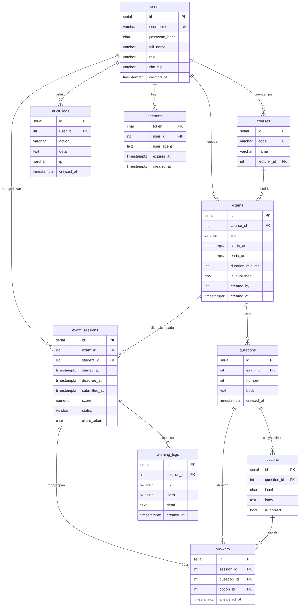

# ERD - Ruang Ujian

Entity Relationship Diagram basis data sistem ujian online.

```mermaid
erDiagram
    users ||--o{ courses : "mengampu"
    users ||--o{ exams : "membuat"
    users ||--o{ exam_sessions : "mengerjakan"
    users ||--o{ audit_logs : "pelaku"
    users ||--o{ sessions : "login"

    courses ||--o{ exams : "memiliki"
    exams ||--o{ questions : "berisi"
    questions ||--o{ options : "punya pilihan"

    exams ||--o{ exam_sessions : "dikerjakan pada"
    exam_sessions ||--o{ answers : "menyimpan"
    exam_sessions ||--o{ warning_logs : "memicu"
    questions ||--o{ answers : "dijawab"
    options ||--o{ answers : "dipilih"

    users {
        serial id PK
        varchar username UK
        char password_hash
        varchar full_name
        varchar role
        varchar nim_nip
        timestamptz created_at
    }
    courses {
        serial id PK
        varchar code UK
        varchar name
        int lecturer_id FK
    }
    exams {
        serial id PK
        int course_id FK
        varchar title
        timestamptz starts_at
        timestamptz ends_at
        int duration_minutes
        bool is_published
        int created_by FK
        timestamptz created_at
    }
    questions {
        serial id PK
        int exam_id FK
        int number
        text body
        timestamptz created_at
    }
    options {
        serial id PK
        int question_id FK
        char label
        text body
        bool is_correct
    }
    exam_sessions {
        serial id PK
        int exam_id FK
        int student_id FK
        timestamptz started_at
        timestamptz deadline_at
        timestamptz submitted_at
        numeric score
        varchar status
        char client_token
    }
    answers {
        serial id PK
        int session_id FK
        int question_id FK
        int option_id FK
        timestamptz answered_at
    }
    warning_logs {
        serial id PK
        int session_id FK
        varchar level
        varchar event
        text detail
        timestamptz created_at
    }
    audit_logs {
        serial id PK
        int user_id FK
        varchar action
        text detail
        varchar ip
        timestamptz created_at
    }
    sessions {
        char token PK
        int user_id FK
        text user_agent
        timestamptz expires_at
        timestamptz created_at
    }
```
